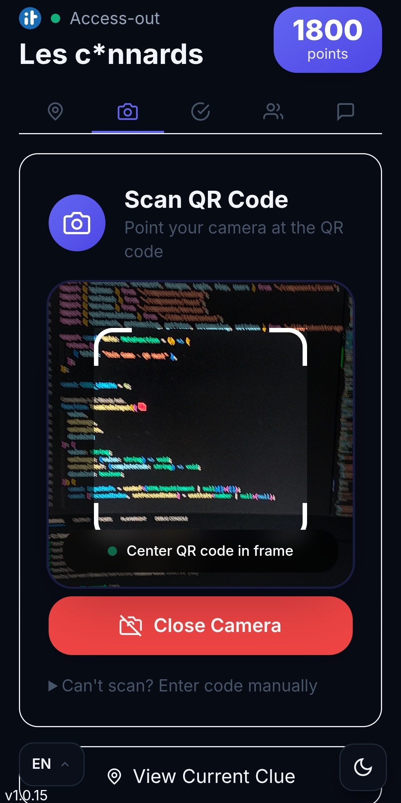
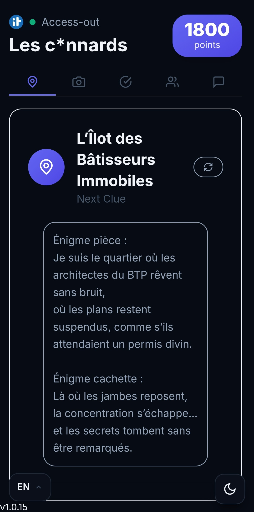
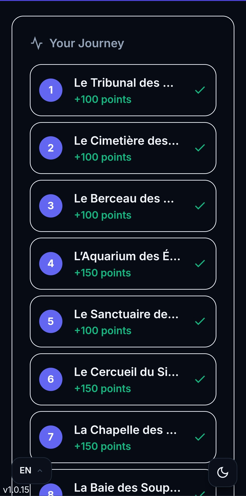
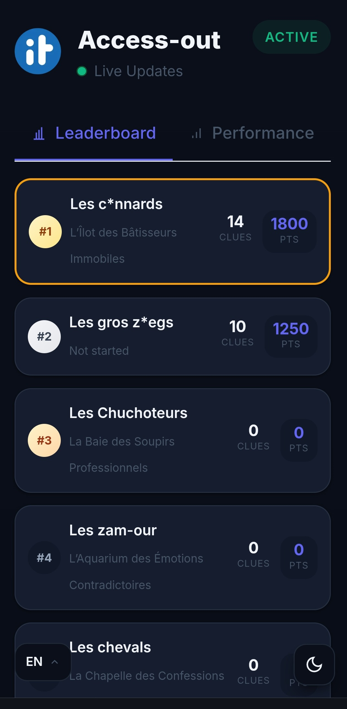
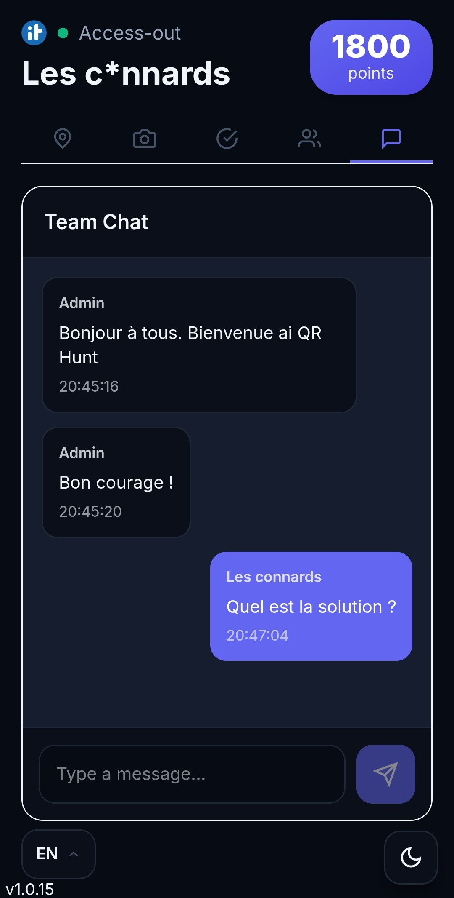

# QR Hunt

> 🤖 **This entire project was created from scratch by Claude Code (Opus 4.5) — AI-powered development, made for humans.**

**Create memorable scavenger hunts in minutes.** A self-hostable platform for QR code treasure hunts with real-time leaderboards, team chat, and no app downloads required.

[](LICENSE)
[](https://claude.ai)

## What is QR Hunt?

QR Hunt is an interactive treasure hunt game where teams race to find hidden QR codes scattered around a location. Each QR code reveals a clue leading to the next location. The first team to find all codes wins!

### The Player Experience

```
┌─────────────────────────────────────────────────────────────────┐
│                         TEAM JOINS                               │
│  Player opens link → Enters 6-digit team code → Ready to play   │
└─────────────────────────────────────────────────────────────────┘
                              ▼
┌─────────────────────────────────────────────────────────────────┐
│                        READ THE CLUE                             │
│  "Find the old oak tree near the fountain in the main square"   │
└─────────────────────────────────────────────────────────────────┘
                              ▼
┌─────────────────────────────────────────────────────────────────┐
│                      HUNT & DISCOVER                             │
│  Team discusses → Explores the area → Finds the hidden QR code  │
└─────────────────────────────────────────────────────────────────┘
                              ▼
┌─────────────────────────────────────────────────────────────────┐
│                         SCAN & SCORE                             │
│  Opens camera → Scans QR → Points awarded → Next clue revealed  │
└─────────────────────────────────────────────────────────────────┘
                              ▼
                    ↺ Repeat until victory!
```

### Perfect For

- **Team building events** — Get colleagues collaborating and exploring
- **Birthday parties** — Turn any venue into an adventure
- **Educational activities** — Campus tours, museum hunts, history walks
- **Corporate events** — Conferences, onboarding, product launches
- **Community events** — City-wide hunts, festival activities

## Why QR Hunt?

- **Zero friction for players** — Join with a 6-digit code, scan with your camera, no app needed
- **Works offline** — Cached clues, pending scans sync when back online
- **Installable PWA** — Add to home screen for native app experience
- **GDPR compliant** — Cookie-free authentication using localStorage
- **Real-time everything** — Live leaderboards, instant chat, immediate feedback
- **Team presence** — See who's online in waiting room before the game starts
- **Self-hosted** — Your data, your server, one Docker command
- **Multilingual** — Built-in support for English, French, and Portuguese
- **Flexible gameplay** — Linear paths, random exploration, or collect-them-all modes

## Screenshots

<p align="center">
  
  
  
  
  
</p>

## Features

### 🎮 For Players
| Feature | Description |
|---------|-------------|
| **Instant Join** | 6-character code auto-submits — no signup or account required |
| **Pre-filled Join Links** | Share links with `?teamCode=ABC123` for animated auto-fill |
| **Browser QR Scanner** | Camera-based QR scanning works on any device — no app needed |
| **Clue Navigation** | Each scan reveals the next clue with smooth reveal animations |
| **Progress Tracking** | See X/Y codes found, points always visible in header |
| **Offline Mode** | Cached clues visible without network, pending scans sync when back online |
| **Waiting Room** | See "X of Y ready" teams with real-time connection status before game starts |
| **Team Chat** | Message organizers for hints, receive broadcasts |
| **Dark/Light Theme** | Automatic system preference detection with manual toggle |
| **Multilingual** | Full support for English, French, and Portuguese |
| **PWA Install** | Add to home screen for native app experience with install prompt |
| **Countdown Timer** | Visual countdown before game starts with sound effects |
| **Sound Effects** | Audio feedback for scans, success, and game events |

### 🎯 For Organizers
| Feature | Description |
|---------|-------------|
| **Visual Node Builder** | Drag-and-drop creation of game nodes with connections |
| **Multi-game Support** | Run multiple hunts simultaneously with different settings |
| **Advanced QR Generator** | Customizable colors, logo embedding, error correction levels (L/M/Q/H), PNG/SVG export |
| **Bulk QR Export** | Download all QR codes as ZIP archive |
| **Share Links** | Copy team join links with pre-filled codes |
| **Real-time Monitoring** | Watch team progress live with SSE updates |
| **Performance Analytics** | Charts showing team timing per clue |
| **Team Presence** | See which teams are online in waiting room with heartbeat detection |
| **Broadcast Chat** | Message all teams or individual teams |
| **Undo Delete** | 20-second recovery window for accidental deletions |
| **Game Duplication** | Clone existing games for quick setup |
| **Flexible Content** | Clues support text, images, videos, and YouTube embeds |
| **Password Protection** | Optional node passwords for extra security |
| **Points System** | Configurable points per node with bonus support |

### 🎲 Game Modes
| Mode | Description |
|------|-------------|
| **Linear** | Teams follow a fixed path from start to end |
| **Random** | Any order after the starting clue, shuffle for variety |
| **Collect All** | Find every QR code to complete the hunt |

### 🏆 Ranking Modes
| Mode | Description |
|------|-------------|
| **Points** | Rank teams by total points earned |
| **Clues Found** | Rank by number of clues discovered |
| **Time** | Fastest team to complete wins |

### ⚡ Technical Features
| Feature | Description |
|---------|-------------|
| **SSE Real-time** | Server-Sent Events for instant leaderboard & chat updates |
| **Heartbeat System** | Real-time team presence detection with 15s timeout |
| **Cookie-free Auth** | localStorage + Bearer tokens for GDPR compliance |
| **Offline Support** | Service Worker caching, pending scan queue |
| **PWA Ready** | Installable progressive web app with manifest |
| **SQLite Database** | No external database setup needed |
| **Docker + Caddy** | One-command deploy with automatic HTTPS |
| **Rate Limiting** | API protection against abuse |
| **Input Validation** | Zod schemas for all API endpoints |
| **Comprehensive Tests** | 671+ unit and integration tests |
| **E2E Testing** | Playwright tests for full game flows |
| **TypeScript** | Full type safety across frontend and backend |
| **Hot Reload** | Fast development with Vite HMR |

### 🌍 Internationalization (i18n)
- **English** — Full translation
- **French** — Full translation  
- **Portuguese** — Full translation
- Easy to add new languages with JSON files

## Quick Start

### Docker (Recommended)

```bash
git clone https://github.com/yourusername/qr-hunt.git
cd qr-hunt
cp .env.example .env
# Edit .env: set ADMIN_CODE and DOMAIN
docker compose up -d
```

### Local Development

```bash
npm install
npm run dev
# App: http://localhost:3000 | API: http://localhost:3002
```

## How It Works

**Organizers:**
1. Access `/admin` → Create game → Add nodes with clues → Connect them
2. Generate QR codes → Print and place them
3. Create teams → Share join codes → Activate game

**Players:**
1. Visit game URL → Enter team code
2. Read clue → Find location → Scan QR
3. Repeat until all codes found → Win!

## Configuration

| Variable | Default | Description |
|----------|---------|-------------|
| `ADMIN_CODE` | `admin123` | Admin panel access code |
| `DOMAIN` | `localhost` | Your domain (enables HTTPS) |
| `DATA_DIR` | `./data` | Database location |
| `PORT` | `3002` | API port |

## Architecture

```
┌─────────────────────────────────────────────────────────────────────┐
│                          QR Hunt Architecture                        │
├─────────────────────────────────────────────────────────────────────┤
│  Frontend (Remix + React)          │  Backend (Fastify + SQLite)    │
│  ─────────────────────────         │  ────────────────────────────  │
│  • PWA with Service Worker         │  • RESTful API                 │
│  • Camera QR Scanner               │  • SSE for real-time updates   │
│  • Offline-first design            │  • Bearer token auth           │
│  • i18n (EN/FR/PT)                 │  • Zod validation              │
│  • Tailwind CSS styling            │  • Domain-driven design        │
└─────────────────────────────────────────────────────────────────────┘

app/                  # Remix frontend (React)
├── components/       # UI components
│   ├── Button.tsx    # Polymorphic button (button/link/anchor)
│   ├── Modal.tsx     # Centralized modal with header/footer
│   ├── Card.tsx      # Card container
│   ├── WaitingRoom.tsx # Pre-game lobby with team presence
│   ├── QRScanner.tsx # Camera-based QR code scanner
│   ├── QRCodeGenerator.tsx # Advanced QR generator with customization
│   ├── Chat.tsx      # Real-time team chat
│   ├── ClueDisplay.tsx # Clue rendering with media support
│   ├── GameCountdown.tsx # Pre-game countdown timer
│   ├── RevealAnimation.tsx # Animated clue reveals
│   ├── ThemeToggle.tsx # Dark/light mode switcher
│   ├── LanguageSelector.tsx # i18n language picker
│   ├── InstallPrompt.tsx # PWA install banner
│   └── Toast.tsx     # Notification system
├── routes/           # Pages: play, join, admin, leaderboard
├── hooks/            # Shared logic (useQRScanner, useSSE, useOfflineMode)
├── i18n/             # Translations (en.json, fr.json, pt.json)
├── lib/              # Utilities (API client, sounds, token storage)
└── config/           # Frontend constants

server/               # Fastify backend
├── api/
│   ├── routes/       # REST endpoints + SSE streams
│   │   ├── admin.ts  # Game/node/team management
│   │   ├── auth.ts   # Team authentication
│   │   ├── scan.ts   # QR code scanning
│   │   ├── chat.ts   # Team messaging
│   │   ├── leaderboard.ts # Real-time rankings
│   │   ├── feedback.ts # Player feedback
│   │   └── health.ts # Health checks
│   ├── middleware.ts # Auth & rate limiting
│   └── schemas.ts    # Zod validation schemas
├── domain/           # Business logic
│   ├── services/     # GameService, TeamService, ScanService
│   ├── repositories/ # Data access layer
│   └── types.ts      # TypeScript interfaces
├── db/               # SQLite migrations & seeds
└── config/           # Server constants
```

## Commands

```bash
npm run dev          # Development mode
npm run build        # Production build
npm start            # Start production server
npm test             # Run tests (watch mode)
npm run typecheck    # Type checking
```

## Tech Stack

| Layer | Technologies |
|-------|--------------|
| **Backend** | Node.js 20+, Fastify 5, TypeScript, SQLite (better-sqlite3) |
| **Frontend** | Remix 2, React 18, Vite 6, Tailwind CSS |
| **Real-time** | Server-Sent Events (SSE) |
| **Validation** | Zod schemas |
| **QR Codes** | qrcode (generation), jsQR (scanning) |
| **Testing** | Vitest (unit), Playwright (E2E) |
| **Deploy** | Docker, Caddy (auto HTTPS) |
| **PWA** | Service Worker, Web App Manifest |

## License

MIT

---

<p align="center">
  <strong>Built with ❤️ by Claude Code (Opus 4.5)</strong><br>
  <em>AI-powered development, designed for humans</em>
</p>
